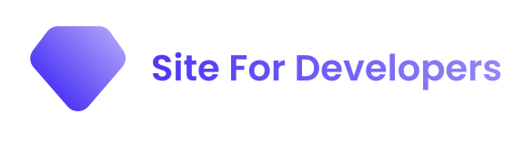

## 어떤 저장소인가요?

- 개발자가 참고하면 좋은 대표적인 웹사이트를 모아놓은 북마크 저장소입니다. 많은 분들에게 도움이 되었으면 좋겠습니다. 🙏🏾
- 또한, 참고하면 좋겠다고 생각되는 웹사이트는 Pull Request 로 참여해 주시면 감사하겠습니다! -> [기여하는 법](https://github.com/currenjin/site-for-developers/blob/main/HOW-TO-CONTRIBUTE.md)
- 기호
  - 오픈소스: Ο
  - 무료: F
  - 유료 혹은 부분적 유료: $
  - 한국어: KR
  - 영어: EN

## 기여자

## 목차

- [어떤 저장소인가요?](#어떤-저장소인가요)
- [기여자](#기여자)
- [추천 👍](#recommend)
- [문서 📃](#document)
  - [Web](#web)
  - [Design](#design)
  - [Programming Language](#programming-language)
  - [Javascript Framework](#javascript-framework)
  - [Backend Framework](#backend-framework)
  - [Public Cloud](#public-cloud)
  - [App](#mobile)
  - [Database](#database)
  - [Search](#search)
  - [Linux](#linux)
  - [Infra](#infra)
  - [API](#api)
  - [Git](#git)
  - [Other](#other)
- [AI 🤖](#ai)
  - [개발 도구](#ai-dev-tools)
  - [대화형 AI](#conversational-ai)
  - [로컬 AI 도구](#ai-local-tools)
- [커뮤니티 💬](#community)
  - [기술 커뮤니티](#tech-community)
  - [교육 커뮤니티](#education-community)
  - [뉴스](#news)
  - [학습](#study)
  - [문제풀이](#coding-test)
- [블로그 📚](#blog)
  - [팀 블로그](#team-blog)
  - [개인 블로그](#personal-blog)
- [동영상 📺](#video)
- [자료모음 🧾](#collection-of-data)
  - [Awesome](#awesome)
- [도구 🔨](#tool)
  - [Search](#search-tool)
  - [Network](#network)
  - [Git](#git-tool)
  - [No Code](#no-code)
  - [API](#api-request)
  - [JSON](#json)
  - [정규 표현식](#regex)
  - [Design](#design-tool)
  - [Backend Framework](#backend-framework-tool)
  - [Code Formatter](#code-formatter)
  - [IDE](#ide)
    - [Jetbrains](#jetbrains)
    - [Other](#other-ide-tool)
  - [Other](#other-tool)

## 링크

- 추천 👍

  - [Stack Overflow EN](https://stackoverflow.com) - Stack Overflow는 개발자가 학습하고 프로그래밍 지식을 공유하며 경력을 쌓을 수 있는 가장 큰 신뢰할 수 있는 온라인 커뮤니티
  - [Wikidocs KR](https://wikidocs.net) - 온라인 책을 제작 공유하는 플랫폼 서비스
  - [TheBook KR](https://thebook.io) - (주)도서출판 길벗에서 제공하는 IT 도서 열람 서비스
  - [Visualgo EN](https://visualgo.net/en) - Visualgo는 2011년 Steven Halim 박사에 의해 학생들이 스스로 그리고 그들만의 속도로 기본적인 것을 배울 수 있도록 함으로써 학생들이 데이터 구조와 알고리즘을 더 ì˜ 이해할 수 있도록 돕는 도구
  - [Roadmap EN. O](https://roadmap.sh) - 개발자들이 경력에서 성장할 수 있도록 커뮤니티 기반 로드맵
  - [Free for Developers EN](https://free-for.dev) - 개발자들과 오픈 소스 저자들은 이제 무료 계층을 제공하는 엄청난 양의 서비스를 제공하고 있지만, 정보에 입각한 의사 결정을 내리기 위해 이들을 모두 찾기는 어려울 수 있습니다
  - [IT Tools EN](https://it-tools.tech/ulid-generator) - 개발자들이 사용하기 편리한 도구를 모아놓은 사이트
  - [Excalidraw](https://excalidraw.com/) - 간편한 다이어그램 작성 도구

- 문서 📃

  - Web
    - [MDN Docs KR](https://developer.mozilla.org/ko/docs/Web/HTML) - MDN Web Docs 사이트는 웹 사이트와 프로그레시브 웹 앱 모두를 위한 HTML, CSS 및 API를 포함한 Open Web 기술에 대한 정보를 제공
    - [Javascript.info KR](https://ko.javascript.info) - 모던 자바스크립트 튜토리얼은 클로저, 문서 객체 모델, 이벤트, 객체 지향 프로그래밍 등의 다양한 주제에 대한 설명과 예시, 과제를 담고 있음
    - [HTML DOM](https://phuoc.ng/collection/html-dom) - 바닐라 자바스크립트를 사용한 DOM 조작 마스터링
    - [Rspack](https://www.rspack.dev) - 빠른 Rust 기반 웹 번들러
    - [Thymeleaf](https://www.thymeleaf.org) - Thymeleaf는 웹 및 독립형 환경 모두를 위한 최신 Server Side Java 템플릿 엔진
    - [Mustache](https://mustache.github.io/) - 로직이 없는 템플릿
    - [web.dev KR, F](https://web.dev/) - 모든 브라우저에서 작동하는 최신 웹 환경을 빌드하기 위한 안내

  - Design
    - [Bootstrap EN](https://getbootstrap.com/) - 강력하고 확장 가능하며 기능이 풍부한 프론트엔드 툴킷
    - [Flexbox Froggy KR](https://flexboxfroggy.com/#ko) - CSS Flexbox 학습용 게임
    - [StyleX EN](https://stylexjs.com/blog/introducing-stylex) - StyleX는 표현력이 뛰어나고 결정적
    - [Tailwind CSS](https://tailwindcss.com) - Tailwind CSS는 HTML을 남기지 않고 최신 웹 사이트를 빠르게 구축하기 위한 유틸리티 우선 CSS 프레임워크
    - [DaisyUI](https://daisyui.com) - 최고의 Tailwind Components 라이브러리. Tailwind CSS용 무료 UI 구성 요소
    - [Flowbite](https://flowbite.com) - Tailwind CSS의 유틸리티 클래스로 구축되고 Figma로 설계된 600개 이상의 UI 구성 요소, 섹션 및 페이지로 구성된 오픈 소스 라이브러리로 시작
    - [Headless UI](https://headlessui.com) - Tailwind CSS와 아름답게 통합되도록 설계된 완전히 스타일화되지 않은 완전히 액세스 가능한 UI 구성 요소
    - [Shadcn UI](https://ui.shadcn.com/) - Tailwind CSS 기반의 접근성 높은 구성 요소를 유연하게 커스터마이징할 수 있는 현대적인 UI 라이브러리
    - [Ant Design](https://ant.design/) - 웹, 앱 디자인을 위한 React UI 프레임워크
    - [Storybook EN,F,O](https://storybook.js.org/) - UI 컴포넌트를 체계적이고 효율적으로 구축할 수 있는 UI 컴포넌트 개발 도구로, UI 컴포넌트 라이브러리의 문서화 ë˜ëŠ” 디자인 시스템을 개발하기 위한 플랫폼 등으로 활용

  - Programming Language
    - [Kotlin Docs](https://kotlinlang.org/docs/home.html) - 코틀린 공식 문서
    - [Java Docs EN](https://docs.oracle.com/en/java) - Java 공식 문서
    - [Python 3 Docs KR](https://docs.python.org/ko/3) - Python3 공식 문서

  - Javascript Framework
    - [Node.js Docs](https://nodejs.org/en/docs) - Node.js 공식 문서
    - [React KR](https://ko.reactjs.org) - React 공식 홈페이지
    - [Next.js Docs](https://nextjs.org/docs/getting-started) - Next.js 공식 문서
    - [Vuejs Guide](https://vuejs.org/guide/introduction.html) - Vuejs 공식 가이드
    - [Express.js KR](https://expressjs.com/ko) - Express.js 공식 홈페이지
    - [NestJS](https://docs.nestjs.com/) - NestJS 공식 문서

  - Backend Framework
    - [Spring Boot Docs EN](https://docs.spring.io/spring-boot/docs/current/reference/htmlsingle) - Spring Boot 공식 문서
    - [Spring Docs EN](https://docs.spring.io/spring-framework/docs/current/reference/html) - Spring 공식 문서
    - [Django Docs KR](https://docs.djangoproject.com/ko/5.0/intro) - Django 공식 문서
    - [Spring Guides](https://github.com/spring-guides) - Spring 튜토리얼 예제
    - [Flask Docs KR](https://flask-docs-kr.readthedocs.io/ko/latest) - Flask 공식 문서
    - [ExpressJS KR](https://expressjs.com/ko) - ExpressJS 공식 홈페이지
    - [Ruby On Rails Guide](https://guides.rubyonrails.org) - Ruby On Rails 공식 가이드
    - [NestJS](https://docs.nestjs.com/) - NestJS 공식 문서
    - [FastAPI Docs KR](https://fastapi.tiangolo.com/ko/) - FastAPI 공식 문서
    - [JUnit 5 User Guide EN](https://junit.org/junit5/docs/current/user-guide/#overview) - JUnit 5 가이드 문서

  - Public Cloud
    - [AWS Documentation KR](https://docs.aws.amazon.com/ko_kr/) - AWS 공식 문서
    - [Azure Documentation KR](https://learn.microsoft.com/ko-kr/azure/?product=popular) - Azure 공식문서
    - [GCP Documentation KR](https://cloud.google.com/docs?hl=ko) - GCP 공식문서
    - [NCP(Naver Cloud Platform Guide KR](https://guide.ncloud-docs.com/docs/home) - Naver Cloud Platform 사용가이드

  - Mobile
    - [Android Guide KR](https://developer.android.com/docs?hl=ko) - Android 공식 가이드
    - [IOS KR](https://developer.apple.com/kr)                     - iOS 공식 개발자 홈페이지
    - [React Native Docs](https://reactnative.dev/docs/getting-started)       - React Native 공식 문서
    - [Flutter Docs KR](https://flutter-ko.dev/docs)               - Flutter 공식 문서

  - Database
    - [Oracle KR](https://www.oracle.com/kr)  - Oracle 공식 홈페이지
    - [MySQL Docs](https://dev.mysql.com/doc)            - MySQL 공식 문서
    - [MongoDB Docs](https://www.mongodb.com/docs)       - MongoDB 공식 문서
    - [PostgreSQL Docs](https://www.postgresql.org/docs) - PostgreSQL 공식 문서
    - [Redis Docs](https://redis.io/docs)                - Redis 공식 문서

  - Search
    - [Elasticsearch Docs](https://www.elastic.co/guide/en/elasticsearch/reference/current/docs.html#docs) - Elasticsearch 공식 문서
    - [Algolia Docs](https://www.algolia.com/doc) - Algolia 공식 문서

  - Linux
    - [Ubuntu Docs KR](https://ubuntu-kr.org) - Ubuntu 공식 문서
    - [Fedora Docs KR](https://docs.fedoraproject.org/ko/docs) - Fedora 공식 문서
    - [Debian Docs KR](https://www.debian.org/index.ko.html) - Debian 공식 문서
    - [openSUSE Docs EN](https://doc.opensuse.org/) - openSUSE 공식 문서
    - [Manjaro Linux Docs EN](https://docs.manjaro.org/) - Manjaro Linux 공식 문서
    - [Rocky Linux Docs EN](https://docs.rockylinux.org/) - Rocky Linux 공식 문서
    - [CentOS Docs EN](https://wiki.centos.org/) - CentOS 공식 문서

  - Infra
    - [Kubernetes Docs KR](https://kubernetes.io/ko/docs/home) - kubernetes 공식 문서
    - [Docker Docs](https://docs.docker.com) - Docker 공식 문서
    - [Argo CD Docs](https://argo-cd.readthedocs.io/en/stable/) - Argo CD 공식 문서
    - [Vagrant Docs](https://developer.hashicorp.com/vagrant/docs) - Vagrant 공식 문서

  - API
    - [Slack API EN](https://api.slack.com) - Slack API 공식 문서
    - [Discord API EN](https://discord.com/developers/docs/intro) - Discord API 공식 문서
    - [GitHub REST API EN](https://docs.github.com/en/rest?apiVersion=2022-11-28) - GitHub REST API 공식 문서
    - [GitHub REST API KR](https://docs.github.com/ko/rest) - GitHub REST API 공식 문서
    - [Google Cloud API KR](https://cloud.google.com/apis?hl=ko) - 구글 클라우드 API 공식 문서

  - Git
    - [Git](https://git-scm.com) - Git 공식 문서
    - [Github App API](https://docs.github.com/ko/apps) - 깃허브 애플리케이션 API 공식 문서
    - [GitHub REST API](https://docs.github.com/ko/rest?apiVersion=2022-11-28) - 깃허브 REST API 공식 문서
    - [GitHub GraphQL API](https://docs.github.com/ko/graphql) - 깃허브 GraphQL API 공식 문서
    - [GitHub Webhook](https://docs.github.com/ko/webhooks) - 깃허브 Webhook 공식 문서

  - Other
    - [Google Developers Docs](https://developers.google.com) - 구글 개발자 공식 문서
    - [Refactoring.Guru$, EN, KR](https://refactoring.guru/ko/design-patterns) - 리팩토링, 디자인 패턴과 관련된 다양한 정보를 담은 문서, 영어 및 한국어로도 작성되어 있어 유지보수가 쉬운 코드를 작성하기 위해 필요한 정보에 대해 쉽게 접근 가능하며 다양한 디자인 패턴과의 관계 파악에 도움이 됨
    - [Patterns.dev EN](https://www.patterns.dev/) - Vanilla JavaScript ë˜ëŠ” 최신 웹 프레임워크를 위한 디자인, 렌더링 및 성능 패턴에 대한 내용을 담고 있음

- AI 🤖

  - 개발 도구
    - [GitHub Copilot $](https://github.com/features/copilot) - GitHub에서 개발한 프로그래밍 AI 보조 도구로, 코드 작성 시 실시간으로 제안을 제공
    - [Cursor F](https://cursor.sh/) - AI 기반 코드 에디터로, 코드 생성 및 편집 기능을 제공하는 개발자 중심 도구
    - [Windsurf F](https://www.windsurf.io/) - AI 기반 개발 도구로, 코드 생성 및 리팩토링을 지원하는 통합 개발 환경
    - [Cody AI F](https://marketplace.visualstudio.com/items?itemName=sourcegraph.cody-ai) - Visual Studio Code AI 플러그인으로 코드 생성 및 개선을 지원
    - [Tabnine $](https://www.tabnine.com/) - Tabnine에서 개발한 프로그래밍 AI로, 코드 자동완성 기능을 제공
    - [Codeium F](https://codeium.com/) - 무료로 사용할 수 있는 AI 코드 생성 도구로, 다양한 IDE와 통합
    - [Amazon CodeWhisperer F](https://aws.amazon.com/ko/codewhisperer/) - AWS에서 개발한 AI 코딩 도구로, 보안 취약점 감지 기능을 포함

  - 디자인 도구
    - [shopify](https://www.shopify.com/tools/logo-maker) - 로고 자동 생성
    - [hatchful](https://hatchful.shopify.com/) - 로고 자동 생성

  - 대화형 AI
    - [ChatGPT](https://chatgpt.com/) - OpenAI에서 개발한 대화형 AI로, 프로그래밍 문제 해결부터 일반적인 질문까지 다양한 작업을 지원
    - [Claude](https://claude.ai) - 앤트로픽에서 개발한 대화형 AI로, 문서 분석 및 복잡한 추론 작업에 강점을 가지고 있음
    - [Gemini](https://gemini.google.com/app?hl=ko) - Google에서 개발한 대화형 AI로, 다양한 Google 서비스와 통합
    - [Perplexity AI](https://www.perplexity.ai/) - 실시간 정보 검색과 AI 답변을 결합한 서비스로, 최신 정보에 기반한 응답을 제공
    - [Bard](https://bard.google.com/) - Google의 대화형 AI로, 다양한 주제에 대한 정보 제공 및 창의적인 콘텐츠 생성을 지원

  - 로컬 AI 도구
    - [Ollama F, O](https://ollama.ai/) - 로컬 환경에서 다양한 오픈소스 AI 모델을 쉽게 실행할 수 있는 도구
    - [LM Studio F](https://lmstudio.ai/) - 로컬 컴퓨터에서 대규모 언어 모델을 테스트하고 실행할 수 있는 데스크톱 애플리케이션
    - [LocalAI F, O](https://github.com/go-skynet/LocalAI) - OpenAI API와 호환되는 로컬 REST API를 제공하는 자체 호스팅 가능한 오픈소스 솔루션
    - [GPT4All F, O](https://gpt4all.io/) - 로컬 환경에서 실행되는 오픈소스 대화형 AI 생태계로, 개인정보 보호에 중점을 둠
    - [PrivateGPT F, O](https://github.com/imartinez/privateGPT) - 로컬 환경에서 문서와 상호작용할 수 있는 프라이버시 중심의 AI 솔루션

  - [OpenAI API](https://platform.openai.com/docs/concepts) - OpenAI API 문서로, AI 모델을 애플리케이션에 통합하는 방법을 제공
  - [Anthropic Developer Docs](https://docs.anthropic.com/en/docs/initial-setup) - Claude API 문서로, Claude AI를 애플리케이션에 통합하는 방법을 제공

- 커뮤니티 💬

  - 기술 커뮤니티
    - [Velog KR](https://velog.io) - 개발자들을 위한 블로그 서비스
    - [Disquiet KR](https://disquiet.io) - IT 서비스 메이커들의 소셜 네트워크
    - [Okky KR](https://okky.kr) - OKKY는 국내 최대 개발자 지식공유 플랫폼
    - [Cikorea KR](https://www.cikorea.net) - CodeIgniter 한국사용자포럼, PHP Framework
    - [Jsdev KR](https://jsdev.kr) - 자바스크립트 개발자 포럼
    - [Laravel KR](https://laravel.kr/) - laravel korea community 라라벨 코리아
    - [프로그래머스 EN](https://qna.programmers.co.kr/) - 프로그래머스 QnA는 프로그래밍 문제해결을 위한 QnA서비스
    - [Devstu KR](https://devstu.co.kr/howto) - 모두가 함께하는, 지식을 지식으로 갚아나가는 한국 개발 커뮤니티
    - [Careerly KR](https://careerly.co.kr) - 개발 트렌드, Q&A, 탑 개발자들과의 네트워킹까지
    - [Stack Exchange EN](https://stackexchange.com) - Stack Overflow 및 170개 이상의 커뮤니티 기반 Q&A 사이트를 만듦
    - [Hashnode EN](https://hashnode.com) - Hashnode는 무료 개발자 블로그 플랫폼으로 자신의 도메인에 기사를 게시할 수 있으며 글로벌 개발자 커뮤니티와 연결될 수 있도록 도와줌
    - [Product Hunt EN](https://www.producthunt.com) - Product Hunt는 매일 최고의 신제품을 큐레이션
    - [Coderanch EN](https://coderanch.com) - 그린혼을 프로그래밍하는 친근한 장소인 Coderanch
    - [Stack Overflow EN](https://stackoverflow.com) - Stack Overflow는 개발자가 학습하고 프로그래밍 지식을 공유하며 경력을 쌓을 수 있는 가장 큰 신뢰할 수 있는 온라인 커뮤니티
    - [매일메일 KR](https://www.maeil-mail.kr/) - 매일 메일로 기술 면접 질문을 보내주는 구독 서비스
    - [Hugging Face EN](https://huggingface.co/) - 세계 최대 규모 AI 커뮤니티

  - 교육 커뮤니티
    - [Inflearn $, KR](https://www.inflearn.com) - 프로그래밍, 인공지능, 데이터, 마케팅, 디자인, 엑셀 실무 등 입문부터 실전까지 업계 최고 선배들에게 배울 수 있는 곳
    - [코딩애플 $, KR](https://codingapple.com/) - 포트폴리오 완성까지 책임지는 Online 프로그래밍 강좌
    - [Swexpertacademy KR](https://swexpertacademy.com/main/learn/course/courseList.do) - SW 프로그래밍 역량 강화에 도움이 ë˜ëŠ” 다양한 학습 컨텐츠를 확인
    - [Nomadcoders $](https://nomadcoders.co) - 실제 구현되어 있는 서비스를 한땀 한땀 따라 만들면서 코딩을 배우
    - [NEXTSTEP $](https://edu.nextstep.camp) - NEXTSTEP에서 개발자들을 위해 디자인된 강의를 수강
    - [freeCodeCamp EN,F](https://www.freecodecamp.org/) - 함께 코딩을 배우는 전 세계 사람들의 커뮤니티이자, 다양한 개발 커리큘럼을 제공하는 온라인 무료 학습플랫폼
    - [Udemy KR](https://www.udemy.com) - Udemy는 213,000개 이상의 강의와 6천 2백만명 이상의 수강생이 있는 온라인 학습 및 교수 마켓플레이스
    - [부스트코스(전 에드위드) KR](https://www.boostcourse.org) - 부스트코스는 네이버(NAVER)와 네이버 커넥트재단(NAVER Connect)이 제공하는 온라인 강좌 플랫폼
    - [TCP School (Java) KR](https://www.tcpschool.com/java/intro) - 4차산업혁명, 코딩교육, 소프트웨어교육, 코딩기초, SW코딩, 기초코딩부터 자바 파이썬 등
    - [Poiemaweb KR](https://poiemaweb.com/) - HTML, CSS, BootStrap, Sass, JS등 웹 프로그래밍 전반에 걸친 깔끔한 학습용 웹 사이트
    - [CodeCrafters EN](https://app.codecrafters.io/catalog) - Redis, DNS 서버 등 실제 소프트웨어 재구현 프로젝트를 통해 프로그래밍을 학습할 수 있는 사이트
    - [Learn Git Branching KR,EN,F](https://learngitbranching.js.org/) - 시각화된 화면과 함께 튜토리얼과 레벨별 게임을 제공하여 손쉽게 Git을 학습할 수 있는 사이트
    - [더북(TheBook) KR](https://thebook.io/) - (주)도서출판 길벗에서 제공하는 IT 도서 열람 서비스
    - [K-MOOC KR](https://www.kmooc.kr/) - 한국형 대학 공개강좌

  - 뉴스
    - [Dzone EN](https://dzone.com) - 프로그래밍, 웹 개발 및 DevOps 뉴스, 초보자부터 전문가를 위한 튜토리얼 및 도구
    - [ZDNet EN](https://www.zdnet.com/) - ZDNET 뉴스와 조언을 통해 전문가들은 혁신을 수용하고 더 나은 미래를 구축할 준비가 되어 있음
    - [ZDNet KR](https://zdnet.co.kr/) - 국가대표 테크미디어
    - [InfoQ EN](https://www.infoq.com) - 개발 팀이 새로운 기술과 관행을 채택할 수 있도록 도움
    - [Techcrunch EN](https://techcrunch.com) - TechCrunch. 기술, 스타트업, 벤처캐피탈 펀딩, 실리콘밸리 사업 보고
    - [개발자스럽다 KR](https://blog.gaerae.com/) - 블로그와 SNS에서 주기적으로 기술 정보를 찾고 분류하여 가치를 더해 공유
    - [요즘IT KR](https://yozm.wishket.com/magazine/list/develop/) - 개발을 위한 모든 IT 콘텐츠를 확인
    - [GeekNews KR](https://news.hada.io/) - 개발 뉴스, 기술 관련 새소식, 스타트업 정보와 노하우, 세상의 재미난 것들을 좋아하는 사람들을 위한 뉴스 사이트. 이메일 뉴스레터/트위터/슬랙 봇으로 구독 가능

  - 학습
    - [Opentutorials KR](https://opentutorials.org) - 비영리 단체 오픈튜토리얼스는 내가 할 수 있는 것을 남도 할 수 있게, 남이 할 수 있는 것을 나도 할 수 있게 하는 콘텐츠를 담아내는 온라인 서비스인 opentutorials.org를 운영하기 위해서 만들어졌음
    - [W3schools EN](https://www.w3schools.com) - HTML, CSS, JavaScript, SQL, Python, PHP, Bootstrap, Java, XML 등을 사용하는 방법에 대한 많은 예와 함께 ì˜ 구성되어 있고 이해하기 쉬움
    - [Codecademy EN](https://www.codecademy.com) - 원하는 직업을 얻기 위한 기술 기술을 배우
    - [Udemy KR](https://www.udemy.com) - Udemy는 213,000개 이상의 강의와 6천 2백만명 이상의 수강생이 있는 온라인 학습 및 교수 마켓플레이스
    - [부스트코스(전 에드위드) KR](https://www.boostcourse.org) - 부스트코스는 네이버(NAVER)와 네이버 커넥트재단(NAVER Connect)이 제공하는 온라인 강좌 플랫폼
    - [TCP School (Java) KR](https://www.tcpschool.com/java/intro) - 4차산업혁명, 코딩교육, 소프트웨어교육, 코딩기초, SW코딩, 기초코딩부터 자바 파이썬 등
    - [Poiemaweb KR](https://poiemaweb.com/) - HTML, CSS, BootStrap, Sass, JS등 웹 프로그래밍 전반에 걸친 깔끔한 학습용 웹 사이트
    - [CodeCrafters EN](https://app.codecrafters.io/catalog) - Redis, DNS 서버 등 실제 소프트웨어 재구현 프로젝트를 통해 프로그래밍을 학습할 수 있는 사이트
    - [Learn Git Branching KR,EN,F](https://learngitbranching.js.org/) - 시각화된 화면과 함께 튜토리얼과 레벨별 게임을 제공하여 손쉽게 Git을 학습할 수 있는 사이트
    - [더북(TheBook) KR](https://thebook.io/) - (주)도서출판 길벗에서 제공하는 IT 도서 열람 서비스
    - [K-MOOC KR](https://www.kmooc.kr/) - 한국형 대학 공개강좌

  - 문제풀이
    - [Baekjoon Online Judge KR, F](https://www.acmicpc.net) - 프로그래밍 문제를 풀고 온라인으로 채점받을 수 있는 곳
    - [Codeforces EN](https://codeforces.com) - Codeforces, 프로그래밍 대회 및 경연대회, 프로그래밍 커뮤니티
    - [Programmers KR](https://school.programmers.co.kr/learn/challenges) - 개발자 취업의 필수 관문 코딩테스트를 철저하게 연습하고 대비할 수 있는 문제를 총망라
    - [코딩도장 KR](https://codingdojang.com) - 프로그래밍 문제풀이를 통해서 코딩 실력을 수련
    - [LeetCode EN, $](https://leetcode.com/) - 코딩 기술을 향상시키고 빨리 직장을 구하세요. 이곳은 여러분의 지식을 확장하고 다음 인터뷰를 준비할 수 있는 최고의 장소
    - [solved.ac KR](https://solved.ac) - 알고리즘 문제해결 학습의 이정표 Baekjoon Online Judge 문제들의 난이도 및 티어 정보를 제공하는 사이트

- 블로그 📚
  - 팀 블로그
    - [코드너리 KR](https://www.codenary.co.kr/) - 기술블로그 모음
    - [벨로퍼스 KR](https://www.velopers.kr/) - 기술블로그 모음
    - [채널톡 기술블로그 KR](https://channel.io/ko/team/blog/topics/3efe1448) - 채널톡 기술블로그
    - [우아한형제들 기술블로그 KR](https://techblog.woowahan.com/) - 우아한형제들 기술블로그
    - [카카오 기술블로그 KR](https://tech.kakao.com/blog/) - 카카오 기술블로그
    - [카카오페이 기술블로그 KR](https://tech.kakaopay.com/) - 카카오페이 기술블로그
    - [쿠팡 기술블로그 KR](https://medium.com/@coupang-engineering-kr) - 쿠팡 기술블로그
    - [왓챠 팀블로그 KR](https://medium.com/watcha) - 왓챠 팀블로그
    - [토스 기술블로그 KR](https://toss.tech/tech) - 토스 기술블로그
    - [컬리 기술블로그 KR](https://helloworld.kurly.com/) - 컬리 기술블로그
    - [뱅크샐러드 기술블로그 KR](https://blog.banksalad.com/tech/) - 뱅크샐러드 기술블로그
    - [올리브영 기술블로그 KR](https://oliveyoung.tech/) - 올리브영 기술블로그
    - [NHN 클라우드 밋업 KR](https://meetup.nhncloud.com/) - NHN 클라우드 밋업
    - [하이퍼커넥트 기술블로그 KR](https://hyperconnect.github.io/) - 하이퍼커넥트 기술블로그
    - [당근마켓 기술블로그 KR](https://medium.com/daangn/development/home) - 당근마켓 기술블로그
    - [강남언니 기술블로그 KR](https://blog.gangnamunni.com/blog/tech/) - 강남언니 기술블로그
    - [요기요 기술블로그 KR](https://techblog.yogiyo.co.kr/) - 요기요 기술블로그
    - [플랫팜 기술블로그 KR](https://medium.com/platfarm/technology/home) - 플랫팜 기술블로그
    - [스포카 기술블로그 KR](https://spoqa.github.io/) - 스포카 기술블로그
    - [라인 기술블로그 KR](https://techblog.lycorp.co.jp/ko) - 라인 기술블로그
    - [쏘카 기술블로그 KR](https://tech.socarcorp.kr/) - 쏘카 기술블로그
    - [리디 기술블로그 KR](https://ridicorp.com/story-category/tech-blog/) - 리디 기술블로그
    - [펫프렌즈 기술블로그 KR](https://techblog.pet-friends.co.kr/) - 펫프렌즈 기술블로그
    - [네이버 D2 KR](https://d2.naver.com/home) - 네이버 기술블로그
    - [AWS 기술블로그 KR](https://aws.amazon.com/ko/blogs/korea/) - AWS 한국 블로그
    - [라포랩스 기술블로그](https://blog.rapportlabs.kr/category/product) - 라포랩스 기술블로그
    - [Engineering at Meta EN](https://engineering.fb.com/) - 메타 엔지니어링 블로그
    - [Amazon Alexa Blogs EN](https://developer.amazon.com/en-US/blogs/alexa) - 아마존 알렉사 블로그
    - [Apple Developer EN](https://developer.apple.com/) - 애플 개발자 블로그
    - [Netflix Tech Blog EN](https://netflixtechblog.com/) - 넷플릭스 기술블로그
    - [Google Developer Blog EN](https://developers.googleblog.com/) - 구글 개발자 블로그
    - [Linkedin Engineering Blog EN](https://www.linkedin.com/blog/engineering) - 링크드인 엔지니어링 블로그
    - [Slack Engineering EN](https://slack.engineering/) - 슬랙 엔지니어링 블로그
    - [The Airbnb Tech Blog EN](https://medium.com/airbnb-engineering) - 에어비앤비 기술블로그
    - [Zoom Developer Blog EN](https://medium.com/zoom-developer-blog) - 줌 개발자 블로그
    - [RiotGames Tech Blog EN](https://technology.riotgames.com/) - 라이엇 게임즈 기술블로그
    - [Pinterest Engineering EN](https://medium.com/@Pinterest_Engineering) - 핀터레스트 엔지니어링 블로그
    - [PayPal Tech Blog EN](https://medium.com/paypal-tech) - 페이팔 기술블로그
    - [Ebay Tech Blog EN](https://innovation.ebayinc.com/tech/) - 이베이 기술블로그
    - [X (구 Twitter) Engineering EN](https://blog.twitter.com/engineering/en_us) - X (구 Twitter) 엔지니어링 블로그
    - [GooglePlay Engineering EN](https://medium.com/googleplaydev) - 구글 플레이 엔지니어링 블로그
    - [Dropbox Tech Blog EN](https://dropbox.tech/) - Dropbox 기술블로그
    - [Spotify Engineering EN](https://engineering.atspotify.com/) - Spotify 엔지니어링 블로그
    - [Github Engineering EN](https://github.blog/engineering/) - Github 엔지니어링 블로그
  - 개인 블로그
    - [기억보단 기록을 KR](https://jojoldu.tistory.com/) - jojoldu 블로그 

- 동영상 🎦

  - [개발 관련 유튜브 모음 KR](https://mp4.okdevtv.com/) - OKdevTV 국내 개발 관련 유튜버 영상 모음
  - [조코딩 JoCoding KR](https://www.youtube.com/@jocoding) - 프로그래밍에 대해 아무것도 모르더라도 개발이 가능하도록 기초부터 차근차근 쉽게 설명
  - [생활코딩 KR](https://www.youtube.com/@coohde) - 일반인에게 프로그래밍을 알려주는 온라인/오프라인 활동
  - [우아한테크 KR](https://www.youtube.com/@woowatech) - 우아한형제들의 기술조직 동영상
  - [MIT Theory of Computation EN](https://www.youtube.com/watch?v=9syvZr-9xwk&list=PLUl4u3cNGP60_JNv2MmK3wkOt9syvfQWY&index=1) - MIT에서 제공하는 Michael Sipserì˜ CS 강의

- 자료모음 🧾

  - [팔만코딩경 KR](https://80000coding.oopy.io/) - 개발 관련 자료모음
  - [토리맘의 한글라이즈 프로젝트 KR](https://godekdls.github.io/) - Spring Boot 한글 번역 문서
  - [Google Labs EN](https://haebom.dev/51q3vdn2p96kmxy49prk) - Google 실험실

  - Awesome
    - [Awesome EN, O](https://github.com/sindresorhus/awesome) - 프로그래밍 관련 자료모음
    - [Awesome Node.js EN, O](https://github.com/sindresorhus/awesome-nodejs) - Node.js 관련 자료모음 (Awesome 계열)
    - [Awesome Vue EN, O](https://github.com/vuejs/awesome-vue) - Vue.js 관련 자료모음 (Awesome 계열)
    - [Awesome Svelte EN, O](https://github.com/TheComputerM/awesome-svelte) - Svelte 관련 자료모음 (Awesome 계열)
    - [Awesome Angular EN, O](https://github.com/PatrickJS/awesome-angular) - Angular 관련 자료모음 (Awesome 계열)
    - [Awesome Next.js EN, O](https://github.com/unicodeveloper/awesome-nextjs) - Next.js 관련 자료모음 (Awesome 계열)
    - [Awesome Ruby EN, O](https://github.com/markets/awesome-ruby) - Ruby 관련 자료모음 (Awesome 계열)
    - [Awesome C++ EN, O](https://github.com/fffaraz/awesome-cpp) - C++ 관련 자료모음 (Awesome 계열)
    - [Awesome .NET EN, O](https://github.com/quozd/awesome-dotnet) - .NET 관련 자료모음 (Awesome 계열)
    - [Awesome .NET Core EN, O](https://github.com/thangchung/awesome-dotnet-core) - .NET Core 관련 자료모음 (Awesome 계열)
    - [Awesome CSS EN, O](https://github.com/awesome-css-group/awesome-css) - CSS 관련 자료모음 (Awesome 계열)
    - [Awesome Bootstrap EN, O](https://github.com/awesome-bootstrap-org/awesome-bootstrap) - Bootstrap 관련 자료모음 (Awesome 계열)
    - [Awesome Tailwind CSS EN, O](https://github.com/aniftyco/awesome-tailwindcss) - Tailwind CSS 관련 자료모음 (Awesome 계열)
    - [Awesome Fonts EN, O](https://github.com/brabadu/awesome-fonts) - 폰트 관련 자료모음 (Awesome 계열)
    - [Awesome Icons EN, O](https://github.com/notlmn/awesome-icons) - 아이콘 관련 자료모음 (Awesome 계열)
    - [Awesome Web Icons EN, O](https://github.com/vkarampinis/awesome-icons) - 웹 아이콘 관련 자료모음 (Awesome 계열)
    - [Awesome Mcp Servers EN, O](https://github.com/punkpeye/awesome-mcp-servers) - MCP Server 관련 자료모음 (Awesome 계열)
    - [Awesome Maintainers EN, O](https://github.com/nayafia/awesome-maintainers) - Open source maintainer 모음 (Awesome 계열)
    - [Algovis EN, O](https://github.com/enjalot/algovis) - 알고리즘 시각화 자료모음 (Awesome 계열)
    - [Awesome Courses EN](https://github.com/prakhar1989/awesome-courses) - 무료 CS 강좌 모음 (Awesome 계열)
    - [Awesome Docker EN](https://github.com/veggiemonk/awesome-docker) - 도커 자료모음 (Awesome 계열)
    - [Awesome Data Science EN](https://github.com/academic/awesome-datascience) - 데이터 사이언스 자료모음 (Awesome 계열)
    - [Awesome Learn Data Science EN](https://github.com/siboehm/awesome-learn-datascience) - 데이터 사이언스 학습 자료모음 (Awesome 계열)
    - [Awesome Computer Science EN](https://github.com/ossu/computer-science) - 컴퓨터 사이언스 자료모음 (Awesome 계열)
    - [Awesome Computer Vision EN](https://github.com/jbhuang0604/awesome-computer-vision) - 컴퓨터 비전 자료모음 (Awesome 계열)
    - [Awesome Functional Programming EN](https://github.com/lucasviola/awesome-functional-programming) - 함수형 프로그래밍 자료모음 (Awesome 계열)
    - [Awesome JVM EN](https://github.com/deephacks/awesome-jvm) - JVM 자료모음 (Awesome 계열)
    - [Awesome Empirical Software Engineering EN](https://github.com/dspinellis/awesome-msr) - 경험적 소프트웨어 엔지니어링 자료모음 (Awesome 계열)
    - [Awesome Generative AI EN](https://github.com/steven2358/awesome-generative-ai) - 생성형 AI 자료모음 (Awesome 계열)
    - [Awesome Interview Questions EN](https://github.com/DopplerHQ/awesome-interview-questions) - 인터뷰 질문 자료모음 (Awesome 계열)
    - [Awesome CodeRabbit EN](https://github.com/coderabbitai/awesome-coderabbit) - 코드래빗 자료모음 (Awesome 계열)
    - [Awesome Playwright EN](https://github.com/mxschmitt/awesome-playwright) - 플레이라이트 자료모음 (Awesome 계열)
    - [Awesome Deep Learning EN](https://github.com/ChristosChristofidis/awesome-deep-learning) - 딥 러닝 자료모음 (Awesome 계열)
    - [Awesome GeoJson EN](https://github.com/tmcw/awesome-geojson) - Geo JSON 자료모음 (Awesome 계열)
    - [Awesome Microservices EN](https://github.com/mfornos/awesome-microservices) - 마이크로서비스 자료모음 (Awesome 계열)

- 도구 🔨

  - Search
    - [Google](https://www.google.com/) - 검색 엔진
    - [DuckDuckGo](https://duckduckgo.com/) - 개인정보 보호 검색 엔진
    - [Naver](https://www.naver.com/) - 국내 검색 엔진
    - [Daum](https://www.daum.net/) - 국내 검색 엔진

  - Network
    - [My ip address](https://whatismyipaddress.com/ip-lookup) - IP 주소 조회
    - [내도메인.한국](https://xn--220b31d95hq8o.xn--3e0b707e) - 무료 한국 도메인 발급
    - [Fast.com F](https://fast.com/ko/) - 넷플릭스에서 제공하는 인터넷 속도 측정기 (브라우저)

  - Git
    - [Gitmoji](https://gitmoji.dev)                   - 깃 커밋 이모지 모음
    - [GitHub $](https://github.com)        - Git 플랫폼
    - [GitLab $](https://about.gitlab.com/) - Git 플랫폼 (GitHub와 유사)
    - [Bitbucket $](https://bitbucket.org/) - Atlassian에 의해 운영되는 Git 저장소
    - [grep $](https://grep.app/search) - GitHub 공개 저장소 전체를 대상으로 코드를 검색할 수 있는 도구
    - [Learn Git Branching KR,EN,F](https://learngitbranching.js.org/) - 시각화된 화면과 함께 튜토리얼과 레벨별 게임을 제공하여 손쉽게 Git을 학습할 수 있는 사이트
    - [GitDiagram](https://gitdiagram.com/) - Git Repository 내 파일을 Diagram으로 시각화해주는 도구
    - [LGTM Gifs](https://www.lgtmgifs.com/) - Git Commit LGTM GIF 모음

  - No Code
    - [Bubble](https://bubble.io) - 노코드 툴 Bubble
    - [Flutterflow](https://flutterflow.io) - 노코드 툴 Flutterflow
    - [Waveon](https://www.waveon.io) - 노코드 툴 Wave on
    - [Webflow](https://webflow.com/) - 노코드 툴 Webflow
    - [Softr](https://softr.io/) - 노코드 툴 Softr
    - [Adalo](https://adalo.com/) - 노코드 툴 Adalo
    - [Glide](https://www.glideapps.com/) - 노코드 툴 Glide

  - API Request
    - [Postman](https://www.postman.com/downloads) - API 디버그 도구
    - [Swagger](https://swagger.io/) - API Documentation 도구

  - JSON
    - [Formatter](https://formatter.org/json-formatter) - CSS/JSON/HTML 포맷 도구
    - [Jsonformatter](https://jsonformatter.curiousconcept.com) - JSON 포맷 도구

  - 정규 표현식
    - [Regex101](https://regex101.com) - 온라인 정규 표현식 학습 및 테스트
    - [Regexr](https://regexr.com) - 온라인 정규 표현식 도구

  - Design
    - [Figma $](https://figma.com) - UI/UX 디자인 및 프로토타이핑 도구
    - [Draw.io](https://app.diagrams.net) - 다이어그램 작성 도구
    - [Canva](https://www.canva.com/ko_kr) - 무료 디자인 툴
    - [DGM](https://dgm.sh/home) - 다이어그램 작성 도구
    - [Pexels](https://www.pexels.com/ko-kr) - 고화질 무료이미지 모음
    - [Emojipedia](https://emojipedia.org) - 이모지 저장소
    - [Excalidraw](https://excalidraw.com/) - 간편한 다이어그램 작성 도구
    - [pixlr](https://pixlr.com/kr/x/) - 포토샵 같은 이미지 편집 도구 
    - [thenounproject](https://thenounproject.com/) - ppt용 백터 이미지 
    - [removebg](https://www.remove.bg/ko) - 간편한 누끼 제거 도구
    - [colorhunt](https://colorhunt.co/) - 색상추천 도구
    - [coolors](https://coolors.co/) - 색상추천 도구
    - [0to255](https://0to255.com/) - 유사 색상의 음영도 확인 도구
    - [msaez](https://www.msaez.io/) - 마이크로서비스 아키텍처 다이어그램 작성 도구

  - Backend Framework
    - [Spring Initializr](https://start.spring.io) - Spring 프로젝트 생성기
    - [Ktor Project Generator](https://start.ktor.io/#/settings) - Ktor 프로젝트 생성기

  - Code Formatter & Linter
    - [Ktlint](https://pinterest.github.io/ktlint/latest/) - 코틀린 코드 포메터
    - [Prettier](https://prettier.io/) - 대표적인 코드 포매터
    - [ESLint](https://eslint.org/) - 자바스크립트 린터
    - [Biome](https://biomejs.dev/) - Web을 위한 통합 툴체인

  - IDE
    - Jetbrains
      - [Fleet $](https://www.jetbrains.com/ko-kr/fleet) - Jetbrains에서 개발한 텍스트 에디터
      - [IntelliJ IDEA $](https://www.jetbrains.com/ko-kr/idea) - Jetbrains에서 개발한 통합 개발 환경 (Java, Kotlin)
      - [CLion $](https://www.jetbrains.com/ko-kr/clion) - Jetbrains에서 개발한 통합 개발 환경 (C, C++)
      - [DataGrip $](https://www.jetbrains.com/ko-kr/datagrip) - Jetbrains에서 개발한 통합 개발 환경 (SQL)
      - [DataSpell $](https://www.jetbrains.com/ko-kr/dataspell) - Jetbrains에서 개발한 통합 개발 환경 (SQL)
      - [WebStorm $](https://www.jetbrains.com/ko-kr/webstorm) - Jetbrains에서 개발한 통합 개발 환경 (JavaScript)
      - [PyCharm $](https://www.jetbrains.com/ko-kr/pycharm) - Jetbrains에서 개발한 통합 개발 환경 (Python)
      - [RubyMine $](https://www.jetbrains.com/ko-kr/ruby) - Jetbrains에서 개발한 통합 개발 환경 (Ruby)
      - [Rider $](https://www.jetbrains.com/ko-kr/rider/) - Jetbrains에서 개발한 통합 개발 환경 (C#, .NET)
      - [Writerside $](https://www.jetbrains.com/ko-kr/writerside) - Jetbrains에서 개발한 통합 개발 환경 (Document)
      - [RustRover $](https://www.jetbrains.com/ko-kr/rust) - Jetbrains에서 개발한 통합 개발 환경 (Rust)
      - [GoLand $](https://www.jetbrains.com/ko-kr/go) - Jetbrains에서 개발한 통합 개발 환경 (Go)
      - [Aqua $](https://www.jetbrains.com/ko-kr/aqua) - Jetbrains에서 개발한 통합 개발 환경 (Testing)
      - [Android Studio F](https://developer.android.com/studio?hl=ko) - Jetbrains에서 개발한 통합 개발 환경 (Android)

    - Other
      - [Visual Studio Code O, F](https://code.visualstudio.com) - Microsoft에서 개발한 텍스트 에디터
      - [Visual Studio $](https://visualstudio.microsoft.com/ko) - Microsoft에서 개발한 통합 개발 환경
      - [Cursor IDE $](https://www.cursor.com/) - VSCode 기반 AI 코드 에디터
      - [Geany O, F](https://www.geany.org/) - 빠르고 가벼운 통합 개발 환경
      - [sublime Text $](https://www.sublimetext.com/) - 크로스 플랫폼의 텍스트 에디터
      - [Notepad++ O, F](https://notepad-plus-plus.org/) - 윈도우 전용 텍스트 에디터
      - [Eclipse](https://www.eclipse.org) - 자바 기반의 통합 개발 환경
      - [Colab](https://colab.research.google.com/?hl=ko#) - 호스팅된 Jupyter 노트북 서비스로, 설정하지 않고 사용 가능하며 GPU를 포함한 컴퓨팅 리소스를 무료로 사용
      - [Xcode](https://developer.apple.com/kr/xcode/) - Apple에서 개발한 통합 개발 환경
      - [online gdb](https://www.onlinegdb.com) - 온라인 컴파일러 및 디버거 도구
      - [URL Encode and Decode](https://www.urlencoder.org/) - 온라인 url 인코더/디코더

  - Other
    - [TTSMaker](https://ttsmaker.com/ko) - 텍스트 음성 변환 도구
    - [IT Tools](https://it-tools.tech) - 개발할 때 유용한 Crypto, Converter, Parser 기능이 있는 웹사이트
    - [xdiarys](https://www.xdiarys.com/?src=windows) - 배경화면에 설치 가능한 일정 관리 캘린더
    - [엔팩스](https://www.enfax.com/) - 신속한 팩스 전송 도구
    - [HexEd.it](https://hexed.it/) - 브라우저 기반의 Hex Editor
